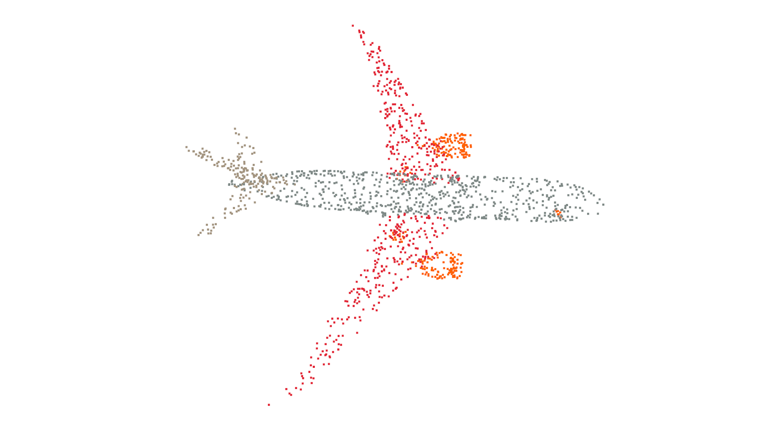

# Pointnet2 Part segmentation
This repo is implementation for [PointNet++](https://arxiv.org/abs/1706.02413) part segmentation in PyTorch. It is based on [pytorch_geometric](https://github.com/rusty1s/pytorch_geometric) and offers:
 - Clean implementation of [PointNet++](https://arxiv.org/abs/1706.02413) part segmentation model
 - Implementation of [PointNet](https://arxiv.org/abs/1612.00593) part segmentation model
 - Training of [ShapeNet](http://web.stanford.edu/~ericyi/project_page/part_annotation/index.html) dataset
 - Visualization of segmentation result
 - No need to directly compile anything


# Requirements
- PyTorch
- [pytorch_geometric](https://github.com/rusty1s/pytorch_geometric)
- [Open3D](https://github.com/intel-isl/Open3D)(optional, for visualization of segmentation result)

## Quickly install pytorch_geometric and Open3D with Anaconda
```
$ pip install --verbose --no-cache-dir torch-scatter
$ pip install --verbose --no-cache-dir torch-sparse
$ pip install --verbose --no-cache-dir torch-cluster
$ pip install --verbose --no-cache-dir torch-spline-conv (optional)
$ pip install torch-geometric
```

```
conda install -c open3d-admin open3d
```

# Usage
Training
```
python main.py
```

Show segmentation result
```
python vis/show_seg_res.py
```

# Performance
Segmentation on  [A subset of shapenet](http://web.stanford.edu/~ericyi/project_page/part_annotation/index.html).

| Class(mIOU) |Airplane|Bag|Cap|Car|Chair|Earphone|Guitar|Knife|Lamp|Laptop|Motorbike|Mug|Pistol|Rocket|Skateboard|Table
| :---: | :---: | :---: | :---: | :---: | :---: | :---: | :---: | :---: | :---: | :---: | :---: | :---: | :---: | :---: | :---: | :---: | 
| PointNet Offical     | 83.4| 78.7| 82.5| 74.9 |89.6| 73.0| 91.5| 85.9| 80.8| 95.3| 65.2| 93.0| 81.2| 57.9| 72.8| 80.6| 
| PointNet++ Offical   | 82.4| 79.0| 87.7| 77.3 |90.8| 71.8| 91.0| 85.9| 83.7| 95.3| 71.6| 94.1| 81.3| 58.7| 76.4| 82.6| 
| PointNet this repo   | 82.5| 79.6| 79.4|  |  |  |  |  |  |  |  |  |  |  |  |  |
| PointNet++ this repo | 84.8| 80.9| 86.3|  |  |  |  |  |  |  |  |  |  |  |  |  |

Note that,
- This implementation trains each class separately
- There are some minimal implemention differences compared with offical repo
- Some default used training configurations: batch_size=8, nepochs=25, optimizer=adam


Sample segmentation result:



# Links
-  [pointnet.pytorch](https://github.com/fxia22/pointnet.pytorch) by fxia22. This repo's PointNet implementation and tranining code are heavily borrowed from fxia22's repo.
- Official [PointNet](https://github.com/charlesq34/pointnet) and [PointNet++](https://github.com/charlesq34/pointnet2) tensorflow implementations
- [PointNet++ classification example](https://github.com/rusty1s/pytorch_geometric/blob/master/examples/pointnet%2B%2B.py) of pytorch_geometry library
